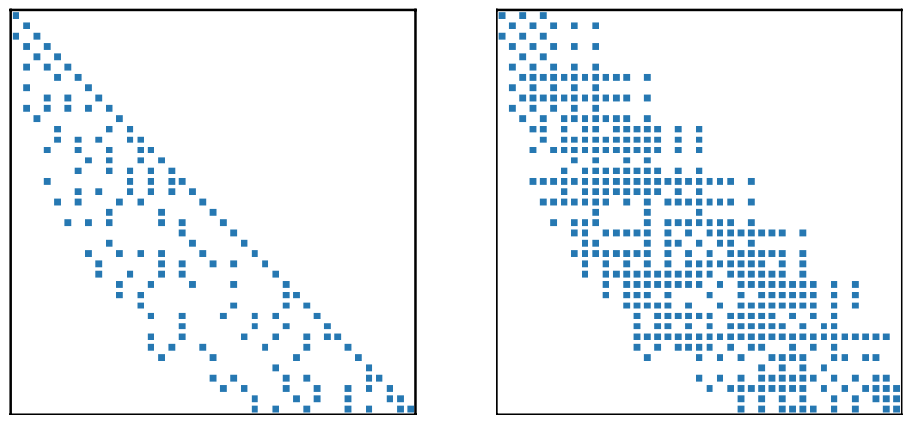
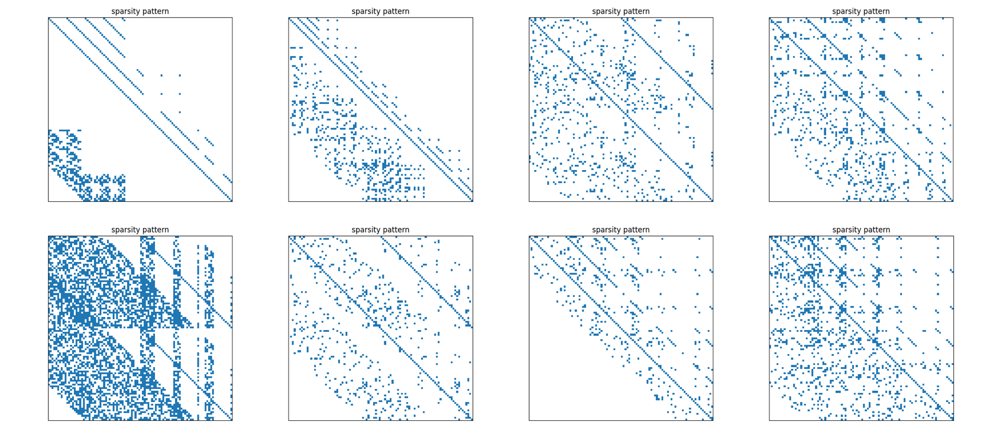
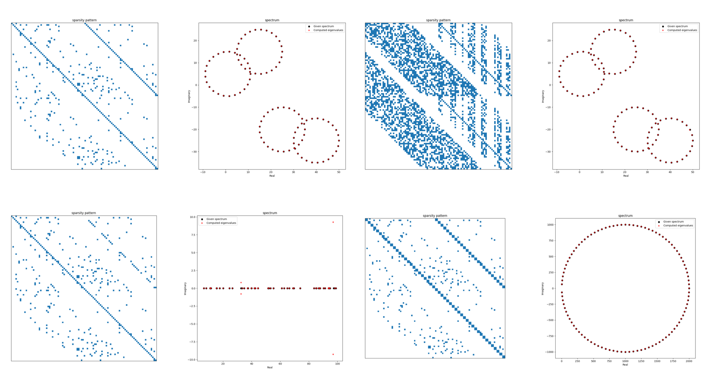

# Sparse Matrix Generator with Given Spectrum

[](https://doi.org/10.5281/zenodo.2694506)

-------------------------------------------------------------------------------

## Overview

Author [Xinzhe Wu](https://brunowu.github.io) @ [Maison de la Simulation](http://www.maisondelasimulation.fr), France (2016-2019).

                                  @ [SDL Quantum Materials](https://www.fz-juelich.de/en/ias/jsc/about-us/structure/simulation-and-data-labs/sdl-quantum-materials), Forschungszentrum Juelich GmbH, Germany (2019-present).

****

### What is SMG2S?

**SMG2S** is able to generate large-scale non-Hermitian and non-Symmetric matrices in parallel with the spectral distribution functions or eigenvalues given by users. SMG2S can be used to benchmark the iterative solvers for both linear systems and eigenvalue problems on supercomputers using the generated very large test matrices with customized spectral properties.

As a matrix generator, SMG2S provides:

- generating of both Non-Hermitian and Non-Symmetric sparse matrix

- generated matrices are naturally Sparse with non-trivial sparsity pattern

- Given Spectrum: the spectrum of generated matrix is the same as the one specified by the users

- Sparsity Patterns are diverse and controllable

As a software, SMG2S provides:

* a collection of C++ header only files
* C++ templated implementation for different data type
* parallel implementation based on [[MPI]](https://en.wikipedia.org/wiki/Message_Passing_Interface) which is able to efficiently generate very large sparse matrices in parallel on supercomputers
* an easy-to-use C interface
* a verification module based on Python for the sparsity pattern plotting and spectrum verification of small size of generated matrix.
* Efficient parallel IO to store the generated matrix into [MatrixMarket format](https://math.nist.gov/MatrixMarket/formats.html)



### Cite SMG2S

If you find SMG2S useful in your project, we kindly request that you cite the following paper:

Wu, Xinzhe, Serge G. Petiton, and Yutong Lu. "A Parallel Generator of Non-Hermitian Matrices computed from Given Spectra." Concurrency and Computation: Practice and Experience, 32(20), e5710, 2020. [[DOI]](https://doi.org/10.1002/cpe.5710) [[PDF]](https://onlinelibrary.wiley.com/doi/pdfdirect/10.1002/cpe.5710?casa_token=UUntHdbHvo4AAAAA:CHJa3O1_B-15_eHKY09LuWdh5TNs_trh_IXa_qDuNZLeTKcxa4CQt9WzrNsU1XSWxunknU8GeXP9Ihv9)

### Gallery: Sparsity Patterns

Here are some sparsity patterns of matrices generated by SMG2S.



### Contact and Contributation

Feel free to contact by email address: **xin DOT wu AT fz BAR juelich DOT de***

## Documentation

### Getting SMG2S

SMG2S is able to available on the Github. The most updated version of SMG2S can be gotten either by the following `git` command:

```bash
git clone https://github.com/SMG2S/SMG2S.git
```

Moreover a released version can be downloaded [here](http)

### Dependencies

SMG2S is developed in `C++14` and `MPI`, and it is compiled with `CMake`. So the following software and compiler should be available before the installation of SMG2S.

1. a `C++` compiler with `C++14` support

2. MPI: message passing interface

3. `CMake`: version >= `3.8`

### Quick start

SMG2S provides an executable `smg2s.exe` that the users can compile and start to play with SMG2S without installation as follows. 

```bash
cd SMG2S
mkdir build & cd build
cmake .. 
make -j
```

Then the executable `smg2s.exe`is available, and it can be run as follows:

```bash
  mpirun -np ${PROCS} ./smg2s.exe -D ${dim} -L ${diag_l} -U ${diag_u} -O ${offset} -C ${nbOne} -S ${sparsity} -M {no-herm or non-symm}
```

in which the command line parsers provides the customization of following parameters:

```bash
usage: ./smg2s.exe [options] ...
options:
  -D, --dim           Dimension of matrix to be generated (int [=1000])
  -L, --diagL         offset of lower diagonal of initial matrix (int [=-10])
  -U, --diagU         offset of upper diagonal of initial matrix (int [=-5])
  -O, --nilpOffset    offset of diagonal of a nilpotent (int [=5])
  -C, --continous     Continuous length in Nilpotent matrix (int [=2])
  -S, --sparsity      sparsity of initial matrix (NOT THE FINAL GENERATED ONES) (double [=0.95])
  -M, --mattype       Matrix type to be generated: non-symmetric or non-Hermitian (string [=non-herm])
  -?, --help          print this message
```

### Installation

SMG2S relies on CMake for compiling and installation. A CMake flag `CMAKE_INSTALL_PREFIX` should be provided for the path of installation.

```bash
cd SMG2S
mkdir build & cd build
cmake .. -DCMAKE_INSTALL_PREFIX=${PATH_TO_INSTALL}
make -j install
```

### Use SMG2S with own project

#### header-only

SMG2S is a collection of C++ header files. If users want to use SMG2S with C++, they can just copy SMG2S headers into their project.

#### CMake

SMG2S is installed as a CMake package, and it can be detected by the classic CMake `find_package` command. If the installation path is not in the default searching path of CMake, a CMake flag `CMAKE_PREFIX_PATH` should be provided which links to the installation path of SMG2S.

So in your own project which want to use SMG2S:

```bash
mkdir build & cd build
cmake .. -DCMAKE_PREFIX_PATH=${INSTALLED_PATH_OF_SMG2S}
make -j
```

and in the `CMakeLists.txt` of own project, it should provide some content as follows:

```cmake
cmake_minimum_required(VERSION 3.8)
project(YOUR-OWN-PROJECT)
#find installation of SMG2S
find_package( smg2s REQUIRED CONFIG)
# for C++ code
add_executable(smg2s-app test_parMatrix.cpp)
target_link_libraries(smg2s-app PUBLIC SMG2S::smg2s)
# for C-interface code
add_executable(test_c.exe test_c.c)
target_link_libraries(test_c.exe PRIVATE SMG2S::smg2s2c)
```

In case that the support of `C++14` is disabled by some `C++` compiler, please insert also the following lines into your `CMakeLists.txt` before the usage of SMG2S.

```cmake
include(CheckCXXCompilerFlag)
CHECK_CXX_COMPILER_FLAG("-std=c++14" COMPILER_SUPPORTS_CXX14)
if(COMPILER_SUPPORTS_CXX14)
    set(CMAKE_CXX_FLAGS "${CMAKE_CXX_FLAGS} -std=c++14")
else()
     message([FATAL_ERROR] "The compiler ${CMAKE_CXX_COMPILER} has no C++14 support. Please use a different C++ compiler.")
endif()
```

### Usage

#### Parallel vector and sparse matrix

In SMG2S, the parallelisation is supported through that both vectors and sparse matrices are naturally distributed across a 1D MPI grid of processes. SMG2S grants the freedom to the user to decide the way to distribute the vector and sparse matrices across a group of processes, e.g, for a parallel vector, user can decide the range of global indices dedicated to each process. 

##### parVectorMap class

`parVectorMap` is a class which determines the way to distribute a vector or sparse matrix across multiple MPI processes:

- This class is to create a mapping from a fixed-size vector to multiple MPI procs in 1D grid.

- This class can also be used to create more distributed vectors and sparse matrices following the same way.

- For each MPI proc, a piece of vector with indexing `[lower_bound, upper_bound)` is allocated.

- This class is templated such that different `integer` can be used to describes the dimension of vector and matrices.

- This class provides a series of member funtions for querying, please refer to [parVectorMap full API](https://smg2s.github.io/SMG2S/classpar_vector_map.html) for more details.

Here is an example:

```cpp
MPI_Init(&argc, &argv);

int world_size;
int world_rank;
int probSize = 7;
MPI_Comm_size(MPI_COMM_WORLD, &world_size);
MPI_Comm_rank(MPI_COMM_WORLD, &world_rank);
int span, lower_b, upper_b;

span = int(ceil(double(probSize)/double(world_size)));

if(world_rank == world_size - 1){
    lower_b = world_rank * span;
    upper_b = probSize - 1 + 1;
}else{
    lower_b = world_rank * span;
    upper_b = (world_rank + 1) * span - 1 + 1;
}
auto parVecMap = parVectorMap<int>(MPI_COMM_WORLD, lower_b, upper_b);
```

##### parVector class

`parVector` class construts a dense vector across a group of MPI processes. 

- It is able to be initialized by a `parVectorMap` object, and following the distribution scheme determined by this `parVectorMap` object.

- It is also able to be directly initialized by the range of global indices of a vector owned by each MPI process, the same as the construction of a `parVectorMap` object.

- This class provides a series of member funtions for querying and manuplating of a distributed vector, please refer to [parVector full API](https://smg2s.github.io/SMG2S/classpar_vector.html) for more details.

- This class is also templated which allows to build a vector with different scalar types, either real or complex, either double precision or single precision....

##### parMatrixSparse class

`parMatrixSparse`class constructs a sparse matrix across a group of MPI processes.

- The sparse matrix is distributed on a 1D MPI process grid by row.
  
  - a `parMatrixSparse` object can be constructed with a `parVectorMap` obejct, such that the distribution of rows of a sparse matrix follows the way determined by this `paraVectorMap` object
  
  - a `parMatrixSparse`object can be also constributed with a `parVector`object, what makes this sparse matrix share the same distribution scheme with this vector.
  
  - For any operations, which takes both sparse matrix and vector, they should also share the same distribution scheme

- This class provides a series of member funtions for querying, manuplating and mathematical operations of a distributed sparse matrices,  please refer to [parMatrixSparse full API](https://smg2s.github.io/SMG2S/classpar_matrix_sparse.html) for more details.

 

#### Building blocks of SMG2S

In order to generate a sparse matrices with user-provided spectrum, SMG2S requires the customization of three building blocks by the users:

1. user-provided spectrum

2. a nilpotent matrix

3. initial matrix

Roughly, the workflow of SMG2S to generate a sparse matrix is that:

1. a strict lower-triangular matrix is generated, which is of the same size as the matrices to be generated. This matrix can be any shape, 
   
   - for generating non-Symmetric matrices of real eigenvalues or non-Hermtian matrices, the only constraint is to be strict lower-triangluar. 
   
   - for generating non-Synmmetric matrices of conjugated eigenvalues, this matrix can be any strict lower-triangluar and the diagonal next to the main diagonal to be empty.

   - In SMG2S, a simple struct `initMat` is provided which stores 4 parameters determining a initial matrix: `diag_l`, `diag_u`, `scale` and `sparisty`. It means that the between diagonal with offset `diag_l` and `diag_u` of lower-triangular part is filled with non-zeros elements randomly generated between `0` and `1`. The values of these elements can also be scaled with the parameter `scale`. The parameter `sparisty` determines that sparsity of inital matrix, not the final generated matrices.

2. the user-provided spectrum is stored in a `parVector` object, which shares the same distribution scheme as initial matrix. 
   
   The spectrum can be generated:
   
   - inplace through the manuplating member functions of the `parVector` class
   
   - by loading from local text files following a specific formats, [click](#format-of-given-spectrum-files) for more details.

   - parallel I/Os are provided which loads the spectrums from local, from more details, please visit [I/O for loading spectrum](https://smg2s.github.io/SMG2S/group__group1.html.html).

   The spectrum vector is to set on the initial matrix in a way that:
   
   - for non-symmetric matrices with real eigenvalues or non-Hermtian matrices, the spectrum will be set directly on the main diagonal.
   
   - for non-symmetric matrices with conjugated eigenvalues, the real parts of eigenvalues are set on the main diagonal, and their imaginary parts are set either on the lower or upper diagonal next to the diagonal following a built-in mechanism in SMG2S. (That's why the lower diagonal next to the main diagonal of initial matrix is expected to be empty for generating non-Symmetric matrices with conjugated eigenvalues).

3. the initial matrix is either right or left multiplied by a nilpotent which manages to more its entries around and keeps the spectrum at the same time. For more details, please see the algorithm shown in our paper: [[PDF]](https://onlinelibrary.wiley.com/doi/pdfdirect/10.1002/cpe.5710?casa_token=UUntHdbHvo4AAAAA:CHJa3O1_B-15_eHKY09LuWdh5TNs_trh_IXa_qDuNZLeTKcxa4CQt9WzrNsU1XSWxunknU8GeXP9Ihv9).

    - a class named `Nilpotent` is implemented in SMG2S, which determines the nilpotent matrix used in SMG2S.

    - this class provides multiple constructors of a nilpotent matrix, either with some simple parameters, or a user-provided vector. please visit [Nilpotent class](https://smg2s.github.io/SMG2S/group__group1.html.html) for more details.


#### Assembling the building blocks

SMG2S provides the generation of matrices in three different categories:

1. non-Hermtian matrices with complex eigenvalues

2. non-Symmetric matrices with real eigenvalues

3. non-Symmetric matrices with conjugated eigenvalues

For each categories, SMG2S provides three functions which allows the users having different levels of freedom to control and customize the properties of generated matrices.

- 1st level: users need to provide multiple simple parameters (for inital matrix and nilpotent) and a local text file containing the eigenvalues. The distribution of matrix over MPI processes is established by using the built-in scheme in SMG2S.

- 2nd level: users need to provide multiple simple parameters (for inital matrix and nilpotent). The spectrum is generated by the user on the fly and stored in a `parVector` object. The generated matrix shares the same distribution scheme as the spectrum vector.

- 3rd level: users need to provide multiple simple parameters for the nilpotent. The initial matrix is provided by the users with the manuplating operations provided by SMG2S. The spectrum is also generated by the user and stored in a `parVector` object which shares the same distribution with the initial matrix.

For more details about the APIs, please visit [here](https://smg2s.github.io/SMG2S/group__group2.html).


#### Mini-app

Here is an mini-app of SMG2S which generates non-Hermitian and non-Symmetric matrices with different types of input spectrum.


```cpp
#include <mpi.h>
#include <smg2s-interface.hpp>

int main(int argc, char** argv) 
{
    MPI_Init(&argc, &argv);
    
    int world_size;
    int world_rank;
    int probSize = 7;
    int l_diag = -7;
    int u_diag = -3;
    int nbOne = 2;
    int offset = 1;
    double sparsity = 0.5;

    /* construct a nilpotent object for generation */
    Nilpotent<int> nilp = Nilpotent<int>(nbOne, offset, probSize);
    
    MPI_Comm_size(MPI_COMM_WORLD, &world_size);
    MPI_Comm_rank(MPI_COMM_WORLD, &world_rank);
    int span, lower_b, upper_b;
    span = int(floor(double(probSize)/double(world_size)));

    if(world_rank == world_size - 1){
        lower_b = world_rank * span;
        upper_b = probSize - 1 + 1;
    }else{
        lower_b = world_rank * span;
        upper_b = (world_rank + 1) * span - 1 + 1;
    }

    /* construct a parVecMap object which determines the distribution scheme of vectors and matrices*/
    auto parVecMap = parVectorMap<int>(MPI_COMM_WORLD, lower_b, upper_b);
    
    /* example 1, generation of a non-Hermtian matrix */
    // 1. generate the spectrum on the fly
    parVector<std::complex<double>, int> spec1 = parVector<std::complex<double>, int>(parVecMap);
    for(int i = lower_b; i < upper_b; i++){
        std::complex<double> v(i+1, i+2);
        spec1.SetValueGlobal(i, v);
    }
    // 2. generation 
    auto mat = nonherm<std::complex<double>, int>(probSize, nilp, initMat<int>(l_diag, u_diag, sparsity), spec1);

    /* example 2, generation of a non-Symmetric matrix with real eigenvalues */
    // 1. generate the spectrum on the fly
    parVector<double, int> spec2 = parVector<double, int>(parVecMap);
    for(int i = lower_b; i < upper_b; i++){
        spec2.SetValueGlobal(i, i+1);
    }
    // 2. generation 
    auto mat2 = nonsymm<double , int>(probSize, nilp, initMat<int>(l_diag, u_diag, sparsity), spec2);

    /* example 3, generation of a non-Symmetric matrix with conjugated eigenvalues */
    // 1. generate the spectrum on the fly
    parVector<std::complex<double>, int> spec3 = parVector<std::complex<double>, int>(parVecMap);

    for(int i = lower_b; i < upper_b; i++){
        if(i % 2 == 0){
            std::complex<double> v(i/2 + 1, i/2 + 2);
            spec3.SetValueGlobal(i, v);
        }else{
            std::complex<double> v(i/2 + 1, -i/2 - 2);
            spec3.SetValueGlobal(i, v);
        }
        if(i == probSize - 1){
            std::complex<double> v(i + 1, 0);
            spec3.SetValueGlobal(i, v);
        }
    }
    // 2. generation 
    auto mat3 = nonsymmconj<double , int>(probSize, nilp, initMat<int>(l_diag, u_diag, sparsity), spec3);

    MPI_Finalize();
}

```


### Format of Given Spectrum Files

SMG2S is able to load user-provided spectrum in parallel from local text files. However, the provided files should conform into a specific format.

1. The first line is the comment part which includes the scalar types of given spectrum. This line should be: `%%SMG2S vector in complex scalar` and `%%SMG2S vector in real scalar` for the eigenvalues in complex or real scalar type, explicitly. **Attention**, for this line, the key word `complex` or `real` should always be there and conform with the type of user-provided spectrum. The parallel IO of SMG2S queries at first this line to check if the provided eigenvalues are complex or real.

2. The second line indicates the number of given eigenvaues in the files. For the ones with `3` complex values, it is `3 3 3`, and for the ones with `3` real eigenvalues, it should be `3 3`.

3. Starting from the `3rd` line, it is the main content of this file. It can have either `2` or `3` columns, which depends on the scalar types of eigenvalues. For the case with complex values, the first column indicates the coordinates for each eigenvalue, the second column contains the real part of eigenvalues, and the third column is for the imaginary part of eigenvalues. For the case with real values, the two columns contain the indexing and values of eigenvalues, respectively. **Attention**, the indexing is `1`-based, rather than `0`-based.  

#### Real eigenvalues for non-Symmetric matrices

For the case with real eigenvalues for non-Symmetric matrices, the given spectrum file format should be as follows:

```
%%SMG2S vector in real scalar
3 3 
1 10
2 3.4790
3 5.0540
```

#### Complex eigenvalues for non-Hermtian matrices

For the complex values for non-Hermitian matrices which are not supposed to be conjugated, the given spectrum is stored in three columns, the first column is the coordinates, the second column is the real part of complex values, and the third column is the imaginary part of complex values. Here is an example with `3` eigenvalues:

    %%SMG2S vector in complex scalar
    3 3 3
    1 10 6.5154
    2 10.6288 3.4790
    3 10.7621 5.0540

#### Conjugate eigenvalues for non-Symmetric matrices

For the non-Symmetric matrices whose entries are all in real scalar, they can have conjugate eigenvalues which are in complex scalar. So in order to generate non-Symmetric test matrices with given conjugated eigenvalues, the give spectrum are always stored in complex form, with three columns.

#### Attention:

For the non-Symmetric matrices, if one eigenvalue is complex, there is another value that they two are symmetric to the real axis in the real-imaginary plain, this is their conjugated eigenvalue. So when setting up the spectral file, one eigenvalue `a+bi` with `b != 0` should be closely followed by another eigenvalue `a-bi`. For the eigenvalues with their imaginary part to be `0`, they are stored with their imaginary part being 0. Here is an example

    %%SMG2S vector in complex scalar
    9 9 9
    1 10.6288 -3.4790
    2 10.6288 3.4790
    3 2.332 0
    4 10.7621 5.0540
    5 10.7621 -5.0540
    6 -2.332 0
    7 -11.02 0
    8 21.21 4.4
    9 21.21 -4.4

### Parallel I/O

#### I/O for parallel vector

#### I/O for parallel sparse matrix

### Interface

#### Interface to C

A basic example of usge:

```c
#include "interface/C/c_wrapper.h"
#include <stdio.h>
#include <mpi.h>

int main(int argc, char* argv[]) {
}
```

### 


