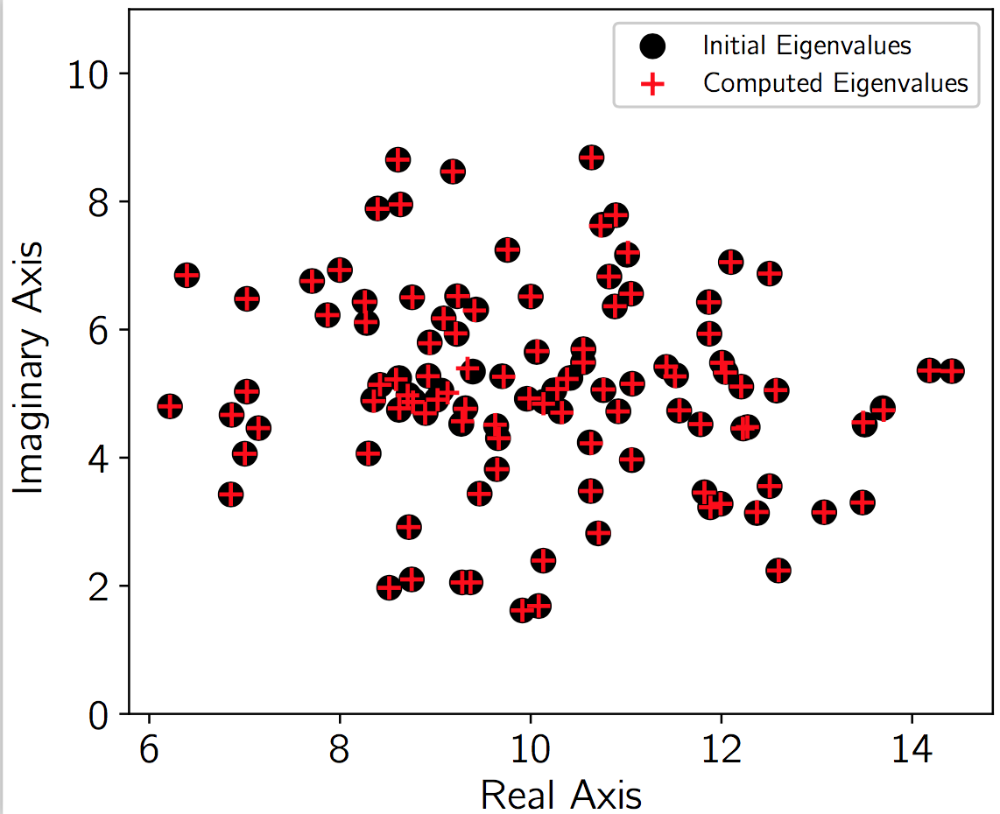

# SMG2S
Sparse Matrix Generator with Given Spectrum

[](https://doi.org/10.5281/zenodo.1247326)

## Update !!!

In the newest version (v1.1) of SMG2S, it supports the generation of nonsymmetric matrices that all the entries of matrices are real and the eigenvalues can be both real and complex.

-------------------------------------------------------------------------------

Author [Xinzhe Wu](https://brunowu.github.io) @ [Maison de la Simulation](http://www.maisondelasimulation.fr), France.

## Cite SMG2S

1. Wu, Xinzhe, Serge G. Petiton, and Yutong Lu. "A Parallel Generator of Non-Hermitian Matrices computed from Given Spectra." International Conference on Vector and Parallel Processing. Springer, Cham, 2018. [(DOI)](https://doi.org/10.1007/978-3-030-15996-2_16)

2. Wu, Xinzhe. SMG2S Manual v1. 0. Maison de la Simulation, 2018. [(PDF)](https://hal.archives-ouvertes.fr/hal-01874810/document)


## Documentation

Website of SMG2S is [here](https://smg2s.github.io/), Developing repository is on [Github](https://github.com/SMG2S).

[Documentation](https://smg2s.github.io/files/smg2s-manual.pdf) is avaiable.

Python version is avaiable on [Pypi](https://pypi.org/project/smg2s/), which can be installed by the command:

```bash
CC=mpicxx pip install smg2s
```

## Installation

### Binary Executable file
In the main directory:

```bash
cmake .  -DCMAKE_INSTALL_PREFIX=${INSTALL_DIRECTORY}
```

Install

```bash
make
```

Execution

```bash
mpirun -np ${PROCS} ./smg2s.exe -SIZE ${MAT_SIZE} -L ${LOW_BANDWIDTH} -C ${CONTINUOUS_ONES} -SPTR ${GIVEN_SPECTRUM_FILE}
```

If ${GIVEN_SPECTRUM_FILE} is not given, SMG2S will use the internal eigenvalue generation method to generate a default spectrum.

### Include files

Install the binary file and includes files into ${INSTALL_DIRECTORY}
```bash
make install
```

Include the SMG2S header file
```cpp
#include <smg2s/smg2s.h>
```

Include and Compile
```bash
mpicxx example.cpp -I${INSTALL_DIRECTORY}/include
```

## Example
### Creation

Include header file

```cpp
#include <smg2s/smg2s.h>
```

Generate the Nilpotent Matrix for operation:
```cpp
Nilpotency<int> nilp;
nilp.NilpType1(length,probSize);
```
Create the parallel Sparse Matrix Object Mt:
```cpp
parMatrixSparse<std::complex<float>,int> *Mt;
```
Generate a new matrix:
```cpp
MPI_Comm comm; //working MPI Communicator
Mt = smg2s<std::complex<float>,int>(probSize, nilp, lbandwidth, spectrum, comm);

```

### Given Spectra file in pseudo-Matrix Market Vector Format

#### Complex values
For the complex values, the given spectrum is stored in three columns, the first column is the coordinates, the second column is the real part of complex values, and the third column is the imaginary part of complex values.

    %%MatrixMarket matrix coordinate complex general
    3 3 3
    1 10 6.5154
    2 10.6288 3.4790
    3 10.7621 5.0540

#### Real Values
For the real values, the given spectrum is stored in two columns, the first column is the coordinates, the second column is related values.

    %%MatrixMarket matrix coordinate real general
    3 3
    1 10
    2 10.6288    
    3 10.7621

## Interface
The cmake will check if PETSc is installed in the platfrom, if yes, header file to interface will also be copied to ${INSTALL_DIRECTORY}/include when installing SMG2S.

### Interface to PETSc

Include header file

```cpp
#include <interface/PETSc/petsc_interface.h>
```

Create parMatrixSparse type matrix

```cpp
parMatrixSparse<std::complex<double>,int> *Mt;
```

Restore this matrix into CSR format

```cpp
Mt->Loc_ConvertToCSR();
```

Create PETSc MAT type
```cpp
MatCreate(PETSC_COMM_WORLD,&A);
```

Convert to PETSc MAT format
```cpp
A = ConvertToPETSCMat(Mt);
```

More information: [PETSc GMRES example](https://github.com/brunowu/SMG2S/tree/master/example/gmres) and [PETSc Arnoldi example](https://github.com/brunowu/SMG2S/tree/master/example/arnoldi)

### Interface to Python
Generate the shared library and install the python module of smg2s
```bash
#install online from pypi
CC=mpicxx pip install smg2s

#bulid in local
cd ./interface/Python
CC=mpicxx python setup.py build_ext --inplace
#or
CC=mpicxx python setup.py build
#or
CC=mpicxx python setup.py install

#run
mpirun -np 2 python generate.py

```

Before the utilisation, make sure that [mpi4py](http://mpi4py.scipy.org/docs/) installed.

A little example of usge:
```python
from mpi4py import MPI
import smg2s
import sys

size = MPI.COMM_WORLD.Get_size()
rank = MPI.COMM_WORLD.Get_rank()
name = MPI.Get_processor_name()

sys.stdout.write(
    "Hello, World! I am process %d of %d on %s.\n"
    % (rank, size, name))

if rank == 0:
        print ('INFO ]> Starting ...')
        print("INFO ]> The MPI Comm World Size is %d" %size)

#bandwidth for the lower band of initial matrix
lbandwidth = 3

#create the nilpotent matrix
nilp = smg2s.NilpotencyInt()

#setup the nilpotent matrix: 2 = continous 1 nb, 10 = matrix size
nilp.NilpType1(2,10)

if rank == 0:
        print("Nilptency matrix continuous one nb = %d" %nilp.nbOne)

Mt = smg2s.parMatrixSparseDoubleInt()

#Generate Mt by SMG2S
#vector.txt is the file that stores the given spectral distribution in local filesystem.
Mt=smg2s.smg2sDoubleInt(10,nilp,lbandwidth,"vector.txt", MPI.COMM_WORLD)
```

### Interface to C

The make install command will generate a shared library `libsmg2s2c.so` into `${INSTALL_DIRECTORY}/lib`. It can be used to profit the C wrapper of SMG2S.

The compile command:

```bash
 mpicc -L${INSTALL_DIRECTORY}/lib -I${INSTALL_DIRECTORY}/include -Wall -o test.exe main.c -lsmg2s2c
```
A basic example of usge:

```c
#include "interface/C/c_wrapper.h"
#include <stdio.h>
#include <mpi.h>

int main(int argc, char* argv[]) {

	MPI_Init(&argc, &argv);

	int size,rank;
	MPI_Comm_size(MPI_COMM_WORLD, &size);
	MPI_Comm_rank(MPI_COMM_WORLD, &rank);

  /*create Nilpotency object*/
	struct NilpotencyInt *n;
  /*create Instance*/
	n = newNilpotencyInt();
  /*setup Nilpotency object*/
	NilpType1(n, 2, 10);
	if(rank == 0){
		showNilpotencyInt(n);
	}

  /*Create parMatrixSparse Object*/
	struct parMatrixSparseDoubleInt *m;
  /*create Instance*/
	m = newParMatrixSparseDoubleInt();
  /*Generate by SMG2S*/
	smg2s(m, 10, n, 3 ," ",MPI_COMM_WORLD);
  /*Matrix View*/
	LOC_MatView(m);

  /*Release Nilpotency Object
  Release parMatrixSparse Object*/
	ReleaseNilpotencyInt(&n);
	ReleaseParMatrixSparseDoubleInt(&m);

	MPI_Finalize();
	return 0;
}
```

### Interface to Trilinos/Teptra CSR matrix

```cpp

#include <interface/Trilinos/trilinos_interface.hpp>
#include <parMatrix/parMatrixSparse.h>

/* 
...
Include the headers of Trilinos/Teptra 
...
*/

/* 
...
Generate matrix Am by SMG2S function
...
*/

/* Trilinos outstream */
Teuchos::RCP<Teuchos::FancyOStream> fos = Teuchos::fancyOStream(Teuchos::rcpFromRef(out));

/* Convert Am to Teptra Matrix format */

Teuchos::RCP<Teptra::CsrMatrix<Scalar Type>> K = ConvertToTrilinosMat(Am);

/* FIX the matrix allocation status, this function should be called after all the modifcations on matrix K are DONE! */
K->fillComplete (); 

/* Shown the matrix K by describe function in Trilinos*/
K->describe(*fos, Teuchos::VERB_EXTREME);

```

Coming soon.


## Verification


